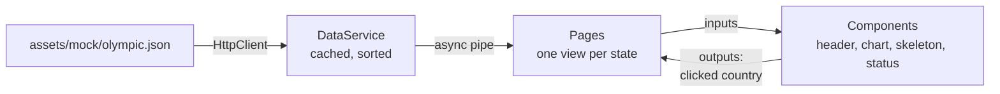

# Architecture

How the application is built, and why. The analysis of the starter code that led to these choices is in [notes-architecture.md](notes-architecture.md), in French.

## Data flow


`DataService` is the only place that talks to the network: one request, kept in memory, countries sorted by total medals. It also computes the indicators and the period covered by the data.

Each page turns that data into what its template needs. Presentation components receive it through inputs and report actions through outputs, and never inject a service.

Switching to a real API changes two files: the address in `environments/`, and `DataService`, where the search for a country becomes a dedicated request such as `GET /olympics/:id`. The models describe the expected answers, and the pages keep working as they are.

## Roles
| Element | Role |
|---|---|
| `DataService` | Loads and sorts the data, finds a country by id, computes indicators and period |
| `DashboardPageComponent` | Introductory text, indicators, and the bar chart whose click opens `/country/:id` |
| `CountryDetailPageComponent` | Reads the id in the URL, reloads on change, redirects unknown ids, shows the line chart |
| `NotFoundPageComponent` | Message and back button, for unknown routes as well as unknown countries |
| `TopBarComponent` | Application name, from `AppComponent` |
| `HeaderComponent` | Page title, and indicators when the page has some |
| `ChartComponent` | Creates, updates and destroys the chart, describes it, reports clicks |
| `PageSkeletonComponent` | Layout of the page in grey blocks, while the data loads |
| `PageStatusComponent` | Message for missing data and errors, with an optional back link |

## Folder structure
```text
src/
├── app/
│   ├── components/                  presentation only: inputs in, outputs out
│   │   ├── chart/                   Chart.js bar or line chart
│   │   ├── header/                  page title and indicators
│   │   ├── page-skeleton/           grey blocks shown while the data loads
│   │   ├── page-status/             "no data" and error messages
│   │   └── top-bar/                 application name, on every page
│   ├── models/                      shape of the data and of the page state
│   ├── pages/                       one folder per route, they hold the logic
│   │   ├── country-detail-page/     /country/:id
│   │   ├── dashboard-page/          /
│   │   └── not-found-page/          /not-found and unknown routes
│   ├── services/
│   │   └── data.service.ts          single entry point to the data
│   ├── app.component.ts             top bar, <main> and <router-outlet>
│   ├── app.config.ts                router and HttpClient providers
│   └── app.routes.ts                route table
├── assets/mock/olympic.json         mocked API response
├── environments/                    address of the data
├── styles/_variables.scss           colors, breakpoints, grid
├── index.html                       loading indicator shown before Angular starts
├── main.ts                          bootstrapApplication
└── styles.scss                      global foundations
```

## Decisions
- Loading happens in two steps. Before Angular starts, `index.html` shows a spinner: the page to display is not known yet. Once started, each page shows grey blocks the size of its own content, so nothing moves when the data arrives.
- An unknown or invalid country id leads to the not-found page without changing the address (`skipLocationChange`). The address typed by the visitor stays visible, and the back button returns to the previous page instead of looping on a redirect.
- Only the parts of Chart.js in use are registered, which keeps the bundle smaller. Each chart is destroyed with its component, and a small plugin writes the country names above the bars rather than in a left axis, which would squeeze the chart on a phone.

## Conventions
- **One view object per page.** Its `state` says which of loading, empty, error or loaded is current, and TypeScript exposes the data only in the loaded case.
- **No manual `subscribe()`.** The `async` pipe subscribes and unsubscribes with the template, and `switchMap` restarts the search when the id changes in the URL.
- **Styles live with their component,** except the foundations shared by several of them: grid, main column, button and loading indicator, all in `styles.scss`. Colors, breakpoints and spacing come from `styles/_variables.scss`.
- **Layout on a grid** of 4, 8 then 12 columns, with breakpoints at 768 and 1200 px. Charts and text sit in the main column, narrower on large screens.
- **Accessibility:** one `<h1>` per page, the application name outside the heading hierarchy, `<main>` around the pages, charts described for screen readers, messages announced through `role="status"`, and contrast ratios noted next to each color.

## Known limits
- The charts answer to the mouse and to touch, but not to the keyboard: from the dashboard, a keyboard user cannot open a country.
- The mocked data mixes languages: the interface is in English, the cities are in French.
- There are no automated tests yet. The Karma configuration is still in place for a later project.
