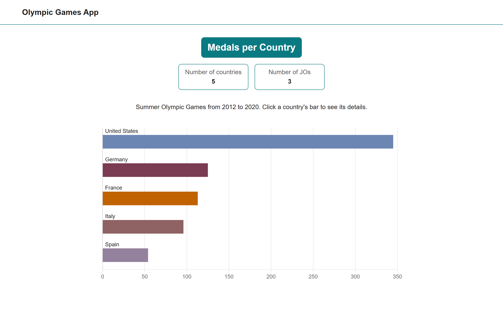
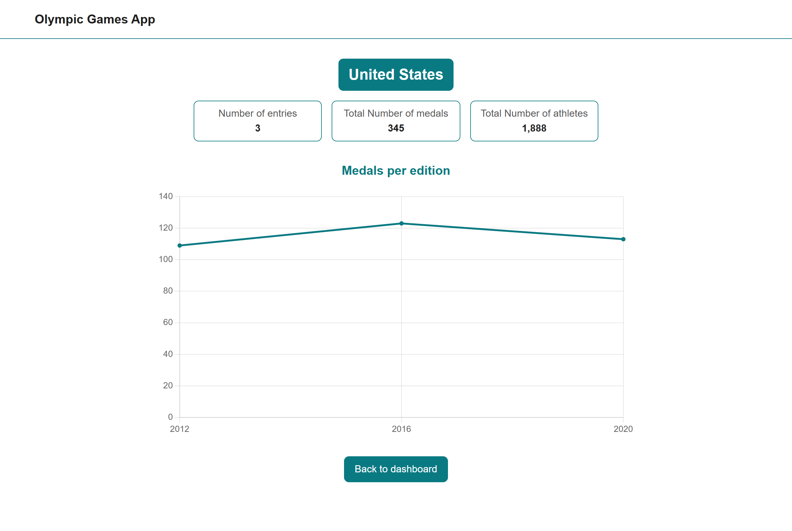

# Olympic Games

Dashboard of the medals won by country at the Summer Olympic Games, from 2012 to 2020. Built with Angular 18 and Chart.js.

## Overview

### Dashboard



### Detail page



## Requirements

- Node.js 22
- npm 10

## Installation

```bash
npm ci
```

`npm ci` installs the exact versions listed in `package-lock.json`, where `npm install` may update them.

## Commands

| Command | What it does |
|---|---|
| `npm start` | Development server on http://localhost:4200/, reloaded on every change |
| `npm run build` | Production build, written to `dist/` |
| `npm run lint` | ESLint on the TypeScript files and the templates |
| `npm test` | Karma. The project has no test yet |

## Data

The application reads `src/assets/mock/olympic.json`, a mocked API answer. Its address lives in `src/environments/`: pointing the application to a real API changes that file and `DataService`, nothing else.

## Documentation

- [ARCHITECTURE.md](ARCHITECTURE.md): data flow, folder structure, decisions and known limits.
- [notes-architecture.md](notes-architecture.md): the analysis of the starter code that led to them, in French.
